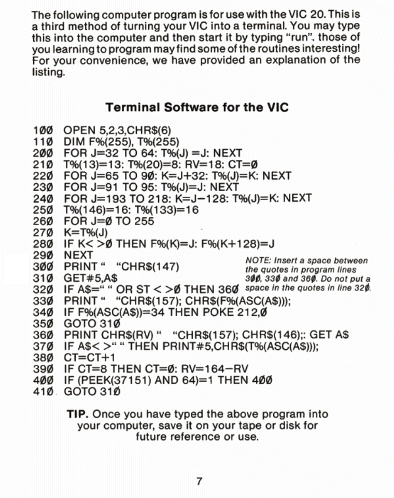

# VIC Term 300
VICTerm is an ASCII Terminal emulator for Commodore VIC-20. It's written in BASIC so it can run just at 300 baud. It's just a slight improvement to a demo BASIC program printed on the VIC-Modem guide

## Improvements
Main improvement is the possibility to use the 21th column of the screen without producing a spurious newline. It's done implementing the cursor blinking through KERNAL routine instead of simulating it with BASIC instructions.

## How to parse .bas file
Use `petcat` tool from VICE distribution on your system. Launch:

    petcat -w2 -l 1001 -o victerm300.prg victerm300.bas

## Original listing
This is the original program, which is printed on the VIC-Modem guide:

