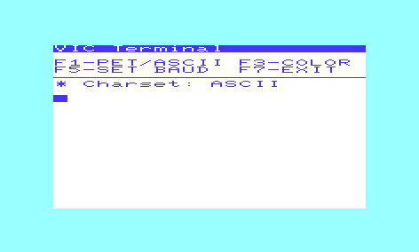

# VIC Term
**VICTerm** is an ASCII Terminal emulator for Commodore VIC-20, written in **C** so it can run at **300/600/1200/2400 baud**. It was written initially as a just slight improvement to a BASIC demo program printed on the VIC-Modem guide, then it was ported to C in order to be faster and more realiable.

It works under **unexpanded VIC-20**, but also versions for expanded ones are provided.

## Improvements
- Possibility to use the **21th column** of the screen without producing a **spurious newline**. It's done implementing the cursor blinking through **KERNAL routines** instead of simulating it with BASIC instructions.
- Implemented **ASCII**/**PETSCII** modes
- In **ASCII** mode, **chr(12)** implements screen cleaning.
- Possibility to connect at **300** / **600** / **1200** / **2400** baud
- Beep when receiving **chr(7)**
- Toggle **B&W** / **Classic** colors.

## How to compile
Run **build.bat** script, on both **Windows** and **Linux/MacOS** operating systems. **CC65** compiler is required. It will generate three **.prg** executable files:
- **victerm.prg**: for *unexpanded* VIC-20s
- **victerm-expanded.prg**: for *expanded* VIC-20s (from **8K to 32K** expansion cartridges)
- **victerm-exp3k.prg**: for VIC-20s with **3K** expansion

All these three executables are included in this repo.

## Credits

Thanks to [**Antonino Porcino**](https://github.com/nippur72/) and [**Fabrizio Caruso**](https://github.com/Fabrizio-Caruso) for their precious suggestions.

## Screenshot

## Original listing
This is the original program, which is printed on the VIC-Modem guide:

